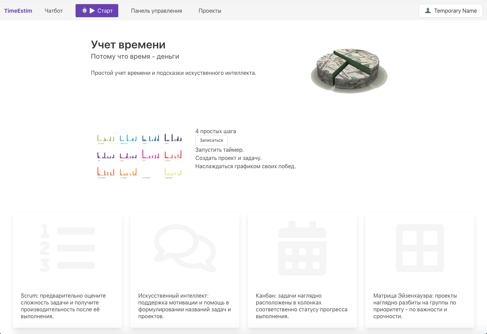

# TimeEstim
The project features a website with multiple time management tools. It's in Russian. It's based on this tutorial: [link to Code With Stein youtube page](https://youtu.be/Sdbh1uHwcrw). I added a chatbot and complexity/velocity, yet removed teams and plans. 



More screenshots in [url](screens/)

If you want to use a version of python prior to python3.8.6: To avoid a recent incompatibility between ChatterBot and spaCy, go to /myvenv/lib/python3.7/site-packages/chatterbot/tagging.py
and replace 
```
      self.nlp = spacy.load(self.language.ISO_639_1.lower())
```
with
```
       if self.language.ISO_639_1.lower() == 'en':
           self.nlp = spacy.load('en_core_web_sm')
       elif self.language.ISO_639_1.lower() == 'ru':
           self.nlp = spacy.load('ru_core_news_sm')
       else:
           self.nlp = spacy.load(self.language.ISO_639_1.lower())
```
